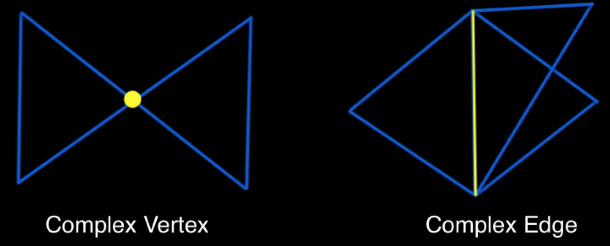

# model repair 
Model repair is the process of removing artifacts such as complex vertices and edges, inconsistent face orientations, gaps, overlaps and (self-)intersections from 3d models. Given the heterogeneous sources used today to create and collect models, repair algorithms attempt to resolve model inconsistencies and flaws by generating outputs suitable for further processing by downstream applications requiring geometrical and topological guarantees for their input. This implementation makes a mesh manifold and orients it consistently.

Note: Requires Eigen 3.2.4 and assumes it is in /usr/local/Cellar/eigen/3.2.4/include/eigen3/
